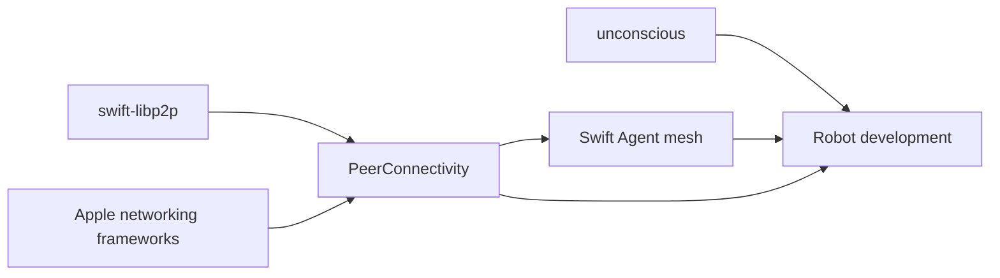
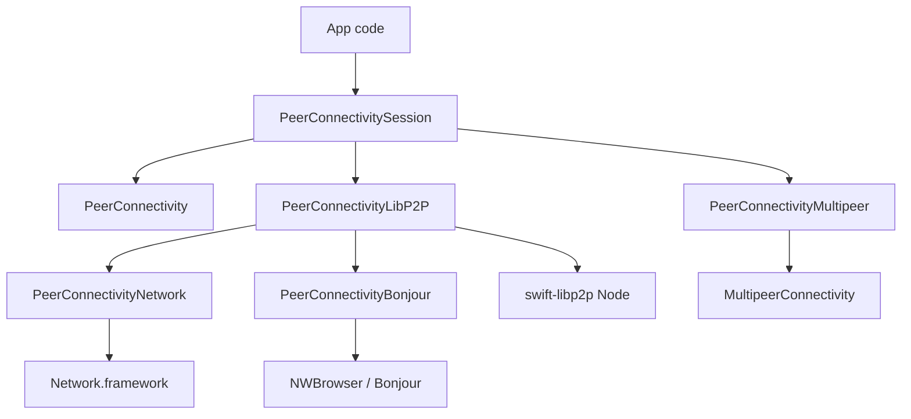
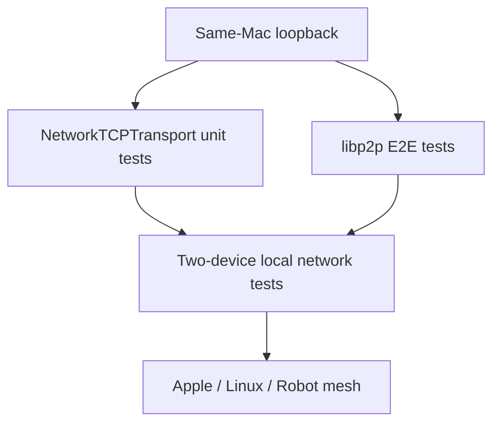

# PeerConnectivity

`PeerConnectivity` is the app-facing API for nearby peer discovery, invitations, and session communication.

The primary API follows the shape of Multipeer Connectivity: browse, advertise, invite, then send messages, streams, or resources. Backend details such as libp2p transports, multiaddrs, and wire compatibility remain available, but they are not the first thing app code needs to learn.

## Design Philosophy

`PeerConnectivity` exists to support a world where Robots can communicate directly with each other over peer-to-peer networks. The immediate stepping stone is a mesh of Swift Agents, and the broader Robot development environment is being built through `unconscious`. This package owns one communication layer in that larger system.



The API should stay simple enough for application and Robot code to use without learning libp2p first. Expert details remain available through explicit backends and capabilities, but the default mental model is discovery, join, send, stream, and resource transfer.

See [Design Philosophy](docs/DESIGN_PHILOSOPHY.md) for the full intent and design constraints.

## Simple Session API

Prefer these methods in application code:

- `startBrowsing()` / `stopBrowsing()`
- `startAdvertising()` / `stopAdvertising()`
- `join(_:)` for a discovered peer
- `invite(_:context:timeout:)` only when invitation semantics matter
- `localPeer()`
- `connectedPeers()`
- `send(_:to:mode:)` for one peer or many peers
- `openStream(named:to:)`
- `sendResource(_:to:)`

`join(_:)` is the primary connection action. It uses the peer's discovered endpoints for direct-connect backends and invitation handling for nearby-session backends.

`startBrowsing()` and `startAdvertising()` require a backend that can control those roles explicitly. If a backend cannot separate discovery roles, the method fails instead of silently starting more behavior than requested. Use `start()` when the application intentionally wants the backend's complete configured lifecycle.

The lower-level `connect(to:)` and `openChannel(to:protocol:)` methods remain available for expert backends and direct libp2p use.

## Backends

- `PeerConnectivity`: platform-neutral facade and shared types.
- `PeerConnectivityLibP2P`: wraps an existing `Node`.
- `PeerConnectivityNetwork`: uses `Network.framework` as a TCP libp2p transport on Apple platforms.
- `PeerConnectivityBonjour`: uses `NWBrowser` and Bonjour TXT `dnsaddr` records.
- `PeerConnectivityMultipeer`: uses `MultipeerConnectivity` for Apple nearby peers.



`NetworkTCPTransport` is a libp2p transport. It keeps Noise, Yamux, and multistream-select in the existing stack, so it can interoperate with TCP libp2p peers on non-Apple platforms. `MultipeerConnectivityBackend` is not libp2p wire compatible and does not report `.libp2pInterop`.

## Test Strategy

Same-Mac loopback tests are mandatory. They are the baseline that can run without preparing multiple physical devices, and they must continue to cover `NetworkTCPTransport` listen, dial, read, write, close, DNS localhost, IPv6 localhost, large payloads, concurrent connections, and libp2p E2E over loopback.



Two-device local network tests are still required before production confidence, but they are a later layer. They should not replace loopback tests.

## Capabilities

Use `PeerConnectivitySession.require(_:)` at startup when the application needs specific behavior:

- `.libp2pInterop`
- `.nearbyDiscovery`
- `.bonjourDiscovery`
- `.inboundListening`
- `.messageSend`
- `.streamMultiplexing`
- `.resourceTransfer`
- `.relay`
- `.backgroundLimited`
- `.invitation`

The same public API can be backed by different transports, but wire compatibility is represented only by capabilities.

## Apple App Configuration

Apps using local network discovery must provide a user-facing `NSLocalNetworkUsageDescription`.

Apps using Bonjour discovery through `PeerConnectivityBonjour` should include the service type used by `NetworkBonjourConfiguration.serviceType` in `NSBonjourServices`. The default service type is:

```text
_p2p._tcp
```

The standard libp2p mDNS UDP route is still owned by `P2PDiscoveryMDNS`. On iOS and iPadOS, multicast mDNS use can require Apple multicast networking entitlement approval. Bonjour over `Network.framework` does not imply libp2p mDNS compatibility.

## Factory Entry Points

Use explicit factories so call sites choose the backend intentionally:

- `PeerConnectivitySession.libp2p(node:capabilities:)`
- `PeerConnectivitySession.appleNetworkLibP2P(configuration:)`
- `PeerConnectivitySession.multipeer(serviceType:displayName:)`

Automatic backend selection is intentionally omitted from the initial API surface.
