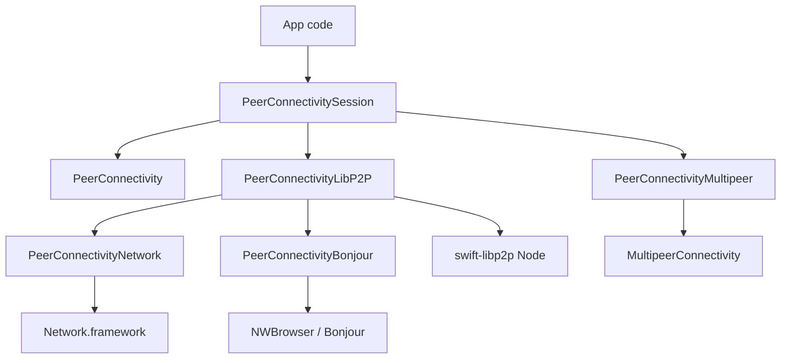
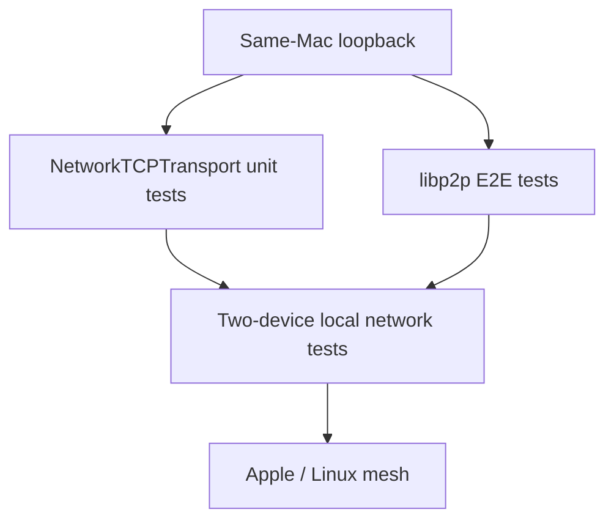

# PeerConnectivity

`PeerConnectivity` is the app-facing API for nearby peer discovery, invitations, and session communication.

The primary API follows the shape of Multipeer Connectivity: browse, advertise, invite, then send messages, streams, or resources. Backend details such as libp2p transports, multiaddrs, and wire compatibility remain available, but they are not the first thing app code needs to learn.

## Goals

The API should stay simple enough for application code to use without learning libp2p first. Expert details remain available through explicit backends and capabilities, but the default mental model is discovery, join, send, stream, and resource transfer.

See [Design Philosophy](docs/DESIGN_PHILOSOPHY.md) for the broader project context and design constraints.

## Installation

Add the package to your `Package.swift` dependencies:

```swift
.package(url: "https://github.com/1amageek/swift-peer-connectivity.git", from: "0.2.0")
```

The libp2p backends require swift-libp2p 0.2.0.

## Usage

Create a session with an explicit backend, browse and advertise when the backend supports those roles, then join discovered peers.

```swift
import NIOCore
import PeerConnectivity
import PeerConnectivityMultipeer

let session = PeerConnectivitySession.multipeer(
    serviceType: "peer-link",
    displayName: "Device A"
)

try session.require([.nearbyDiscovery, .messageSend])
try await session.startBrowsing()
try await session.startAdvertising()

for await event in session.subscribe() {
    switch event {
    case .peerDiscovered(let peer, _):
        let connectedPeer = try await session.join(peer)
        var message = ByteBuffer()
        message.writeString("hello")
        try await session.send(message, to: connectedPeer)
    case .messageReceived(let bytes, let peer):
        handle(bytes, from: peer)
    case .error(let errorEvent):
        handle(errorEvent.error, operation: errorEvent.operation, peer: errorEvent.peer)
    default:
        break
    }
}
```

`subscribe()` returns a NEW independent event stream on each call (multi-consumer
broadcaster semantics). Subscribe BEFORE `start()` / `startBrowsing()` so the
subscription does not miss early events; a subscription only observes events
emitted after it is created. The method form (not a computed property) makes the
per-call cost — minting a new subscriber — explicit at the call site.

Multi-peer `send(_:to:[peers])` is exhaustive, not atomic: it attempts every peer
and, if any fail, throws `PeerSendError` listing per-peer outcomes (which
succeeded, which failed) instead of aborting on the first failure.

`.error` carries a typed `PeerConnectivityErrorEvent` (operation, peer, and the
underlying error) so a failure can be attributed rather than surfaced as a bare
`Error`. Messages and resources use length-prefixed framing, so a truncated
inbound transfer surfaces as a typed error instead of a silently incomplete
payload, and inbound handlers apply an idle timeout.

Use `join(_:)` for discovered peers. It uses endpoints for direct-connect backends and invitations for nearby-session backends. Use `connect(to:)`, `invite(_:context:timeout:)`, and `openChannel(to:protocol:)` when backend-specific behavior is intentional.

`startBrowsing()` and `startAdvertising()` fail when the backend cannot control those roles separately. Use `start()` when the application intentionally wants the backend's complete configured lifecycle.

## Backends

- `PeerConnectivity`: platform-neutral facade and shared types.
- `PeerConnectivityLibP2P`: wraps an existing `Node`.
- `PeerConnectivityNetwork`: uses `Network.framework` as a TCP libp2p transport on Apple platforms.
- `PeerConnectivityBonjour`: uses `NWBrowser` and Bonjour TXT `dnsaddr` records.
- `PeerConnectivityMultipeer`: uses `MultipeerConnectivity` for Apple nearby peers.


```mermaid
flowchart TD
    App["App code"] --> API["PeerConnectivitySession"]
    API --> Common["PeerConnectivity"]
    API --> L["PeerConnectivityLibP2P"]
    API --> M["PeerConnectivityMultipeer"]
    L --> N["PeerConnectivityNetwork"]
    L --> B["PeerConnectivityBonjour"]
    L --> P["swift-libp2p Node"]
    N --> NF["Network.framework"]
    B --> NB["NWBrowser / Bonjour"]
    M --> MC["MultipeerConnectivity"]
```

`NetworkTCPTransport` is a libp2p transport. It keeps Noise, Yamux, and multistream-select in the existing stack, so it can interoperate with TCP libp2p peers on non-Apple platforms. `MultipeerConnectivityBackend` is not libp2p wire compatible and does not report `.libp2pInterop`.

## Test Strategy

Same-Mac loopback tests are mandatory. They are the baseline that can run without preparing multiple physical devices, and they must continue to cover `NetworkTCPTransport` listen, dial, read, write, close, DNS localhost, IPv6 localhost, large payloads, concurrent connections, and libp2p E2E over loopback.


```mermaid
flowchart TD
    Loopback["Same-Mac loopback"] --> Transport["NetworkTCPTransport unit tests"]
    Loopback --> LibP2P["libp2p E2E tests"]
    Transport --> RealDevices["Two-device local network tests"]
    LibP2P --> RealDevices
    RealDevices --> MixedMesh["Apple / Linux mesh"]
```

Two-device local network tests are still required before production confidence, but they are a later layer. They should not replace loopback tests.

## Capabilities

Use `PeerConnectivitySession.require(_:)` at startup when the application needs specific behavior:

- `.libp2pInterop`
- `.nearbyDiscovery`
- `.bonjourDiscovery`
- `.inboundListening`
- `.messageSend`
- `.streamMultiplexing`
- `.resourceTransfer`
- `.relay`
- `.backgroundLimited`
- `.invitation`

The same public API can be backed by different transports, but wire compatibility is represented only by capabilities.

## Apple App Configuration

Apps using local network discovery must provide a user-facing `NSLocalNetworkUsageDescription`.

Apps using Bonjour discovery through `PeerConnectivityBonjour` should include the service type used by `NetworkBonjourConfiguration.serviceType` in `NSBonjourServices`. The default service type is:

```text
_p2p._tcp
```

The standard libp2p mDNS UDP route is still owned by `P2PDiscoveryMDNS`. On iOS and iPadOS, multicast mDNS use can require Apple multicast networking entitlement approval. Bonjour over `Network.framework` does not imply libp2p mDNS compatibility.

## Factory Entry Points

Use explicit factories so call sites choose the backend intentionally:

- `PeerConnectivitySession.libp2p(node:capabilities:)`
- `PeerConnectivitySession.appleNetworkLibP2P(configuration:)`
- `PeerConnectivitySession.multipeer(serviceType:displayName:)`

`appleNetworkLibP2P(configuration:)` is throwing. When `enableBonjour` is set, it requires at least one listen address to announce; otherwise it throws `PeerConnectivityError.listenAddressRequired` rather than advertising `.bonjourDiscovery` it cannot honor.

Automatic backend selection is intentionally omitted from the initial API surface.
