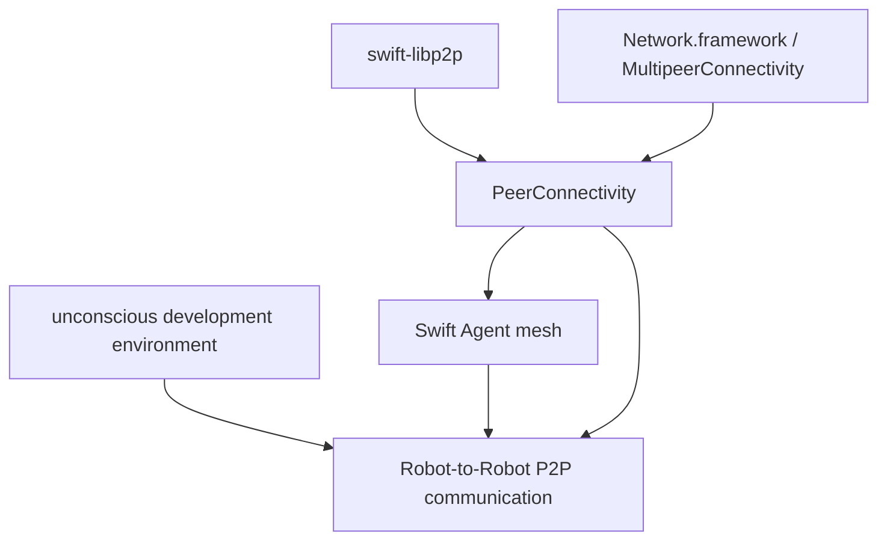
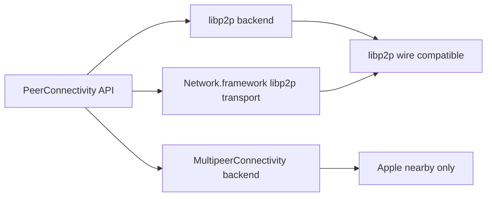
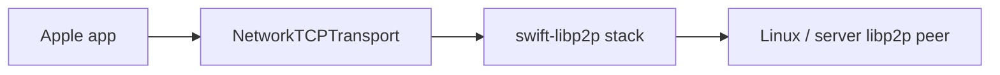
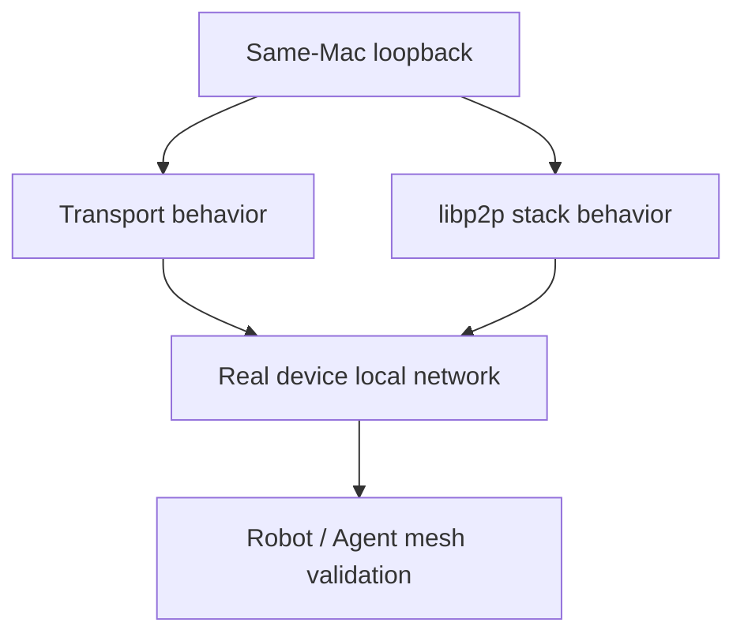

# PeerConnectivity Design Philosophy

`PeerConnectivity` is part of a larger direction: a world where Robots can communicate directly with each other through peer-to-peer networks.

It is not only a convenience wrapper around libp2p, Network.framework, or MultipeerConnectivity. It is the app-facing communication surface for Robot and Agent systems that should be able to discover peers, join them, exchange messages, open streams, and transfer resources without forcing every caller to become a networking specialist.

## System Context



The long-term target is Robot-to-Robot communication.

Before that, there is a Swift Agent mesh: multiple Agents that can find each other, coordinate, and exchange data without assuming a central server.

`unconscious` is the development environment where Robot capabilities are being built. `PeerConnectivity` provides one communication layer for that ecosystem.

## North Star

The public API should feel closer to MultipeerConnectivity than raw libp2p:

- discover nearby or reachable peers
- advertise local presence
- join a peer
- send messages
- open named streams
- transfer resources
- observe connection and transfer events

The application should not need to choose between `invite`, `connect`, endpoint dialing, multiaddr parsing, protocol negotiation, and platform-specific discovery rules during the common workflow. Those details belong behind explicit backends, capability checks, and advanced APIs.

## Design Principles

### 1. Simple first, expert second

Most callers should start from `PeerConnectivitySession` and use:

- `startBrowsing()`
- `startAdvertising()`
- `join(_:)`
- `send(_:to:mode:)`
- `openStream(named:to:)`
- `sendResource(_:to:)`

Advanced calls such as direct endpoint dialing and protocol-specific channel opening remain available, but they are not the primary path.

### 2. One API does not mean one wire protocol

Backends may share the same app-facing API while using different wire behavior.



`PeerConnectivity` must never pretend that incompatible transports are wire-compatible. Compatibility is represented by `PeerConnectivityCapabilities`, especially `.libp2pInterop`.

### 3. Capabilities are a contract

Capabilities must describe behavior the backend can actually provide.

If a backend cannot listen inbound, it must not advertise `.inboundListening`.

If relay is not configured, it must not advertise `.relay`.

If resource transfer is advertised, received resources must be surfaced as events.

`require(_:)` exists so application startup can fail early when the selected backend cannot satisfy the intended deployment model.

### 4. Apple platforms are first-class, not special-case hacks

Apple platforms have real constraints and real strengths:

- `Network.framework` is the right native transport boundary for Apple TCP networking.
- Bonjour through `NWBrowser` is useful for local discovery.
- MultipeerConnectivity is strong for Apple nearby sessions.
- iOS local network privacy and multicast entitlement requirements must be explicit.

These constraints should be modeled in backends and capabilities, not hidden from callers.

### 5. libp2p remains the interoperability path

Robot and Agent systems must eventually communicate beyond Apple-only environments.

For Apple-to-Linux or Apple-to-server communication, the canonical route is:



`NetworkTCPTransport` only changes the Apple transport implementation. Security, stream multiplexing, and protocol negotiation remain in the libp2p stack.

### 6. Same-Mac loopback is a required baseline

Two physical devices are not always available during development, so the test pyramid starts with same-Mac loopback. Loopback tests are not a substitute for real local-network validation, but they are required because they are fast, deterministic, and exercise the transport and libp2p stack continuously.



The loopback baseline must include direct `NetworkTCPTransport` read/write behavior and libp2p E2E over `NetworkTCPTransport`.

### 7. MultipeerConnectivity is nearby, not universal

The Multipeer backend exists because Apple-to-Apple nearby workflows should be simple and native.

It does not provide libp2p wire compatibility. It should not expose libp2p identity as the main peer model. It should support the same simple operations where the framework allows it: messages, streams, resources, browsing, advertising, and invitations.

### 8. Robot and Agent code should not inherit transport complexity

Robot behavior and Agent coordination should be written against stable communication concepts:

- peer
- session
- capability
- event
- message
- stream
- resource

Transport details should be chosen at composition time, not scattered through Robot logic.

## Non-Goals

- Automatic backend selection in the initial API.
- Pretending MultipeerConnectivity can interoperate with libp2p peers.
- Hiding platform requirements such as local network usage descriptions.
- Making every libp2p concept part of the app-facing peer model.

## Practical API Shape

The default usage should read like this:

```swift
let session = PeerConnectivitySession.multipeer(
    serviceType: "robot-link",
    displayName: "Robot A"
)

try await session.require([.nearbyDiscovery, .messageSend])
try await session.startBrowsing()
try await session.startAdvertising()

for await event in await session.events {
    switch event {
    case .peerDiscovered(let peer, _):
        _ = try await session.join(peer)
    case .messageReceived(let bytes, let peer):
        // Handle bytes from peer.
        break
    default:
        break
    }
}
```

For cross-platform Robot communication, the app should choose a libp2p-compatible backend explicitly:

```swift
let session = try await PeerConnectivitySession.appleNetworkLibP2P(
    configuration: configuration
)

try await session.require([.libp2pInterop, .streamMultiplexing])
```

The important distinction is intentional backend choice with a common app-facing workflow.
